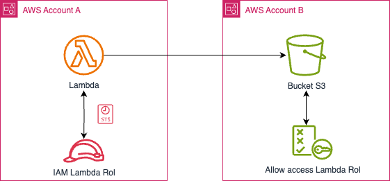

# 🔐 Lambda accediendo a S3 en otra cuenta

## 📝 Descripción del problema

Un desarrollador necesita implementar una función **AWS Lambda en la Cuenta A** que acceda a un bucket de **Amazon S3 en la Cuenta B**. El acceso debe realizarse de forma segura, siguiendo buenas prácticas de IAM sin compartir claves estáticas.

## ✅ Solución

Para permitir que la función Lambda acceda al bucket S3 en otra cuenta, se deben realizar los siguientes pasos:

1. Crear un **rol de ejecución IAM en la Cuenta A** para la función Lambda, que incluya permisos para operar sobre el bucket.
2. Asociar este rol a la función Lambda.
3. Modificar la **política del bucket S3 en la Cuenta B** para **conceder acceso explícito al rol de la Cuenta A** mediante su ARN.
4. AWS Lambda usará automáticamente **credenciales temporales STS** al ejecutar el rol IAM, sin necesidad de manejar claves manualmente.

---

## 🖼️ Diagrama de arquitectura



> 🎯 Puedes editar el diagrama desde: [01-lambda-access-s3-another-account.drawio](./01-lambda-access-s3-another-account.drawio)

---

## 🔧 Configuración de políticas

### 1️⃣ Política IAM en la Cuenta A (rol de Lambda)

```json
{
  "Version": "2012-10-17",
  "Statement": [
    {
      "Effect": "Allow",
      "Action": [
        "s3:GetObject",
        "s3:ListBucket"
      ],
      "Resource": [
        "arn:aws:s3:::nombre-del-bucket-en-cuenta-b",
        "arn:aws:s3:::nombre-del-bucket-en-cuenta-b/*"
      ]
    }
  ]
}
```

### :two: Política del bucket en la Cuenta B
```json
{
  "Version": "2012-10-17",
  "Statement": [
    {
      "Sid": "AllowLambdaFromAccountA",
      "Effect": "Allow",
      "Principal": {
        "AWS": "arn:aws:iam::ID-CUENTA-A:role/NOMBRE-DEL-ROL"
      },
      "Action": [
        "s3:GetObject",
        "s3:ListBucket"
      ],
      "Resource": [
        "arn:aws:s3:::nombre-del-bucket-en-cuenta-b",
        "arn:aws:s3:::nombre-del-bucket-en-cuenta-b/*"
      ]
    }
  ]
}
```

##  🧠 Consideraciones
- Lambda usa automáticamente STS para asumir el rol IAM al ser ejecutada.

- No se deben compartir claves, lo que hace esta solución segura y escalable.

- Usa ```aws sts get-caller-identity``` dentro de Lambda para verificar qué identidad se está usando.

- Siempre aplica el principio de menor privilegio en las políticas.

## 📚 Recursos útiles
- [Allow my Lambda function access to my Amazon S3 bucket](https://aws.amazon.com/premiumsupport/knowledge-center/lambda-execution-role-s3-bucket/)