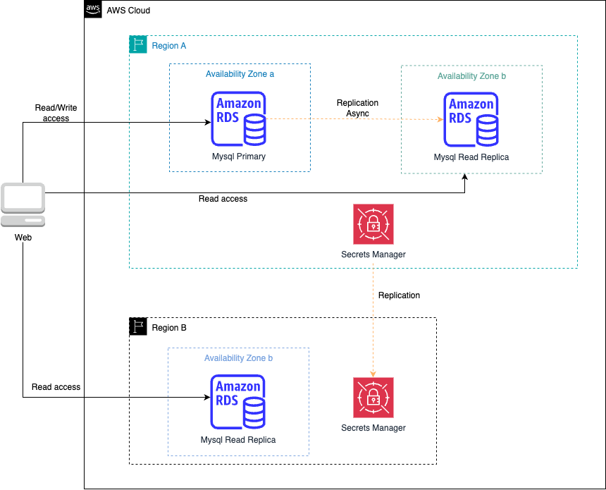

# 🔐 Rotación automática de credenciales RDS con Secrets Manager y replicación multirregional

## 📝 Descripción del problema

Una empresa realiza **mantenimientos mensuales** de su infraestructura distribuida en múltiples regiones de AWS. Como parte de estos mantenimientos, es necesario **rotar las credenciales de bases de datos RDS for MySQL**.

La empresa busca una solución **segura**, **automatizada** y con **mínima carga operativa**, que funcione en varias regiones de forma coherente.

## ✅ Solución

Se recomienda usar **AWS Secrets Manager** con las siguientes características:

1. **Almacenamiento seguro** de credenciales RDS como secretos.
2. **Rotación automática** de secretos mediante un programa definido (por ejemplo, mensual).
3. **Replicación multirregional** para que los secretos estén disponibles en las regiones donde residen las bases de datos RDS.
4. Asignación de permisos finos mediante **IAM** para controlar qué servicios o personas pueden acceder a los secretos.

---

## 🖼️ Diagrama de arquitectura

> 🎯 Diagrama editable: [03-secrets-manager-rotation-multiregion.drawio](./03-secrets-manager-rotation-multiregion.drawio)

---

## 💡 Beneficios clave

- 🔁 **Rotación automática** de contraseñas sin intervención manual.
- 🌍 **Disponibilidad multirregional** para soportar arquitecturas distribuidas.
- 🔐 **Seguridad centralizada** en el manejo de secretos.
- ⚙️ **Menor sobrecarga operativa** comparado con la gestión manual.
- 🎯 Compatible con múltiples motores de bases de datos (MySQL, PostgreSQL, etc.).

---

## 🔧 Consideraciones técnicas

- Al habilitar rotación, AWS Secrets Manager crea una **función Lambda gestionada** que ejecuta la lógica de cambio de contraseña en RDS.
- La replicación se configura desde la **consola** o mediante **CloudFormation / CLI / SDKs**.
- Revisa que las políticas de red permitan la conectividad de la función Lambda a la instancia RDS en cada región.
- Configura **CloudWatch Logs** para monitorear el éxito o fallos en la rotación.

---

## 📚 Recursos útiles

- [Replicación multirregional de secretos](https://aws.amazon.com/blogs/security/how-to-replicate-secrets-aws-secrets-manager-multiple-regions/)
