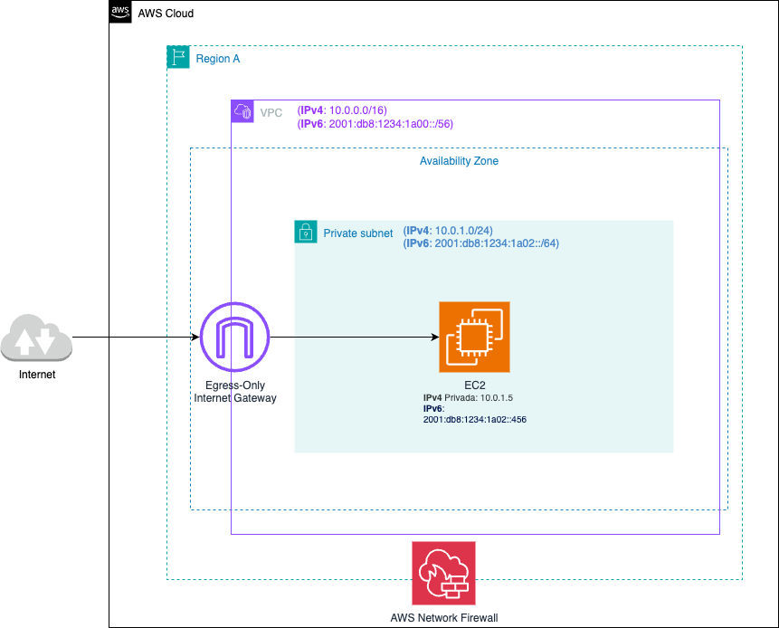

# 🔐 Comunicación IPv6 saliente segura con Egress-Only Gateway y AWS Network Firewall

## 📝 Descripción del problema

Una empresa de procesamiento de pagos planea migrar su aplicación local a una **instancia EC2**  en AWS. Se ha asignado un bloque **CIDR IPv6** a la VPC de producción de la compañía. La política de seguridad exige que solo se permita la **comunicación saliente sobre IPv6 entre la instancia y el internet**, pero se debe evitar que la instancia inicie una conexión entrante con **IPv6**. La nueva arquitectura también debe permitir la inspección del flujo de tráfico y el filtrado de tráfico.
¿Qué hacer para cumplir con estos requisitos?

### Requisitos de seguridad:

- Permitir **solo tráfico saliente sobre IPv6** desde la instancia EC2 hacia internet.
- **Bloquear conexiones entrantes** desde internet hacia la instancia.
- Aplicar **inspección y filtrado de tráfico saliente**.
- Cumplir con políticas corporativas de **seguridad avanzada**.

## ✅ Solución

Implementar la siguiente arquitectura:

1. **Lanzar la instancia EC2 en una subred privada** con conectividad restringida.
2. Configurar un **Egress-Only Internet Gateway** en la VPC para permitir tráfico saliente IPv6 exclusivamente.
3. Utilizar **AWS Network Firewall** para inspeccionar, registrar y filtrar el tráfico saliente de la VPC.

- Tabla de enrutamiento:

| Destino             | Objetivo   |
|---------------------|------------|
| 10.0.0.0/16         | local      |
| 2001:db8: 1234:1a00::/56 | local  |
| ::/0                | eigw-id    |

> 🔎 **Notas**:
> - `local`: Permite el enrutamiento dentro de la VPC (para IPv4 e IPv6).
> - `::/0`: Ruta por defecto para todo el tráfico IPv6 saliente hacia internet.
> - `eigw-id`: ID del **Egress-Only Internet Gateway**.

---

## 🖼️ Diagrama de arquitectura

> 🎯 Diagrama editable: [04-egress-only-firewall-ipv6.drawio](./04-egress-only-firewall-ipv6.drawio)

---

## 💡 Beneficios clave

- 🚫 **Bloqueo automático de conexiones entrantes IPv6** gracias al uso de Egress-Only Internet Gateway.
- 🔎 **Inspección profunda del tráfico (DPI)** con AWS Network Firewall.
- 🎯 Cumplimiento de políticas estrictas de **seguridad de red unidireccional**.
- 📊 Visibilidad sobre flujos de tráfico saliente mediante **CloudWatch Logs** y métricas.
- 🔐 Aislación del entorno de cómputo en una **subred privada** sin exposición directa a internet.

---

## 🔧 Consideraciones técnicas

- **Egress-Only Internet Gateway** permite tráfico saliente IPv6 únicamente. No admite conexiones entrantes.
- **AWS Network Firewall** debe colocarse en **subredes dedicadas**, con rutas configuradas para enviar el tráfico a través del firewall.
- Configura reglas de firewall según políticas de seguridad: por dominio, dirección IP, protocolo, etc.
- Requiere habilitar **IPv6** en la VPC y asociar prefijos IPv6 a subredes privadas.

---

## 📚 Recursos útiles

- [Egress-Only Internet Gateway](https://docs.aws.amazon.com/vpc/latest/userguide/egress-only-internet-gateway.html)