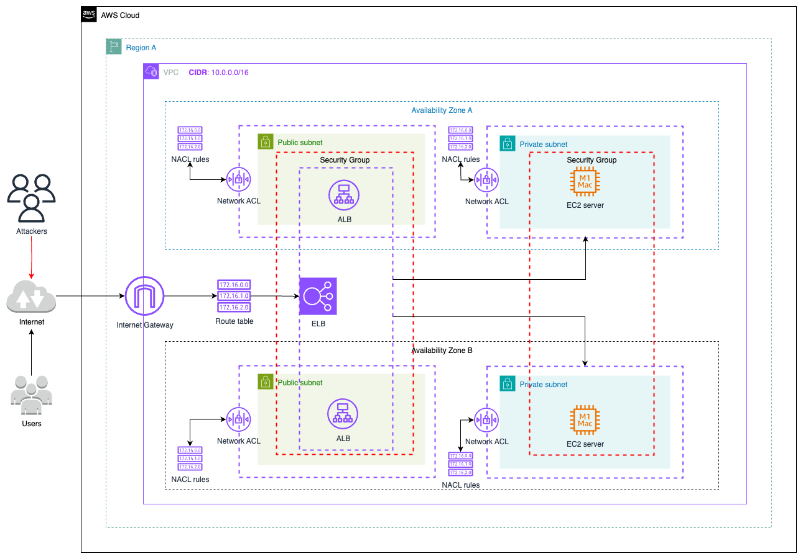

# 🔐 Mitigación inmediata de tráfico malicioso con Network ACL

## 📝 Descripción del problema

Una empresa opera una aplicación de dos niveles para el procesamiento de imágenes. La aplicación utiliza dos Zonas de Disponibilidad, cada una con una subred pública y una subred privada. Un Balanceador de Carga de Aplicaciones (ALB) para el nivel web utiliza las subredes públicas. Las instancias de Amazon EC2 para el nivel de aplicación utilizan las subredes privadas.

Los usuarios informan que la aplicación se está ejecutando más lentamente de lo esperado. Una auditoría de seguridad de los archivos de registro del servidor web muestra que la aplicación está recibiendo millones de solicitudes ilegítimas desde un pequeño número de direcciones IP. Un arquitecto de soluciones necesita resolver el problema de rendimiento inmediato mientras la empresa investiga una solución más permanente.

¿Qué deberías recomendar para cumplir este requisito?

Una empresa opera una **aplicación de dos niveles para procesamiento de imágenes**. Utiliza:

- **Subredes públicas** con un **Application Load Balancer (ALB)**.
- **Subredes privadas** con instancias EC2 para el procesamiento.

La aplicación se distribuye en **dos Zonas de Disponibilidad**.

### Problema

Se identificó una **degradación de rendimiento**. Los registros muestran que **millones de solicitudes ilegítimas** provienen de **un pequeño conjunto de direcciones IP maliciosas**.

## ✅ Solución inmediata

Modificar las **Listas de Control de Acceso de Red (Network ACL)** asociadas a las **subredes públicas del nivel web**, e **insertar reglas de denegación explícita** para bloquear las IPs maliciosas detectadas.

---

## 🖼️ Diagrama de arquitectura

> 🎯 Diagrama editable: [05-bloqueo-ip-nacl.drawio](./05-bloqueo-ip-nacl.drawio)

---

## 💡 Beneficios clave

- ⛔ **Mitigación inmediata** del ataque a nivel de red sin modificar instancias o servicios.
- 🧱 Las NACLs actúan como **cortafuegos a nivel de subred**, permitiendo o bloqueando tráfico entrante/saliente.
- ⚙️ Fácil de configurar y administrar desde la consola, CLI o IaC.
- 🕵️‍♂️ Ayuda a mantener la disponibilidad de la aplicación mientras se investiga una solución más robusta (como WAF).

---

## 🛡️ Ejemplo de configuración de reglas NACL

| Nº | Tipo      | Protocolo | Puerto | Origen              | Acción   |
|----|-----------|-----------|--------|----------------------|----------|
| 100| ALL TRAFFIC | ALL     | ALL    | 203.0.113.45/32      | DENY     |
| 110| ALL TRAFFIC | ALL     | ALL    | 198.51.100.0/24      | DENY     |
| 200| ALL TRAFFIC | ALL     | ALL    | 0.0.0.0/0            | ALLOW    |

> 🔎 Notas:
> - Las NACLs evalúan las reglas en orden por número (ascendente).
> - Al colocar la regla de deny primero, el tráfico desde IPs maliciosas se descarta antes de ser aceptado.
> - Se deben aplicar tanto a reglas entrantes como salientes, si es necesario.

## ⚠️ Consideraciones
- **Las NACL son stateless**, por lo tanto, se debe configurar el tráfico de entrada y salida por separado si se desea mantener la comunicación bidireccional con clientes legítimos.

- **Esta solución no es dinámica**; se deben actualizar manualmente las IPs bloqueadas.

- Para ataques más sofisticados o distribuidos, considera AWS WAF como una solución escalable y automatizada.

- No es viable modificar los **Security Groups** ya que estos son **statefull** y como ya se han aceptado solicitudes malicionas seguirá aceptandolas por que ya guardaron ese estado.