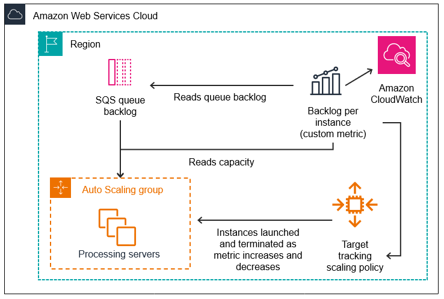

# 🛠️ Arquitectura resistente para procesamiento distribuido con SQS y Auto Scaling

## 📝 Descripción del problema

Una empresa está migrando una aplicación distribuida heredada a AWS. Actualmente, un **servidor primario** coordina los trabajos entre múltiples nodos de cómputo. El sistema debe manejar **cargas de trabajo variables**. La empresa busca modernizar la solución para maximizar **resiliencia** y **escalabilidad**, eliminando puntos únicos de falla.

## ✅ Solución

Se recomienda una arquitectura distribuida basada en los siguientes componentes:

1. **Amazon SQS** para actuar como **buffer de trabajos**. Esto desacopla el productor (el sistema que genera trabajos) de los consumidores.
2. **Amazon EC2 Auto Scaling Group** configurado con una flota de instancias que actúan como nodos de procesamiento.
3. El grupo Auto Scaling ajusta la capacidad automáticamente en función del **número de mensajes en la cola SQS**, usando métricas de **Amazon CloudWatch**.

---

## 🖼️ Diagrama de arquitectura

> 🎯 - [Imagen tomada de aquí](https://docs.aws.amazon.com/autoscaling/ec2/userguide/as-using-sqs-queue.html)

---

## 💡 Beneficios de la solución

- ✅ **Resiliencia**: no hay servidor coordinador único; el sistema continúa funcionando aunque fallen instancias individuales.
- 📈 **Escalabilidad automática**: se adaptan los recursos a la carga real en la cola.
- 🔀 **Desacoplamiento** entre producción y consumo de trabajos.
- 📉 **Uso eficiente de recursos**: se paga solo por lo que se necesita en función de la carga.

---

## 🔧 Consideraciones

- Usa políticas de escalado basadas en `ApproximateNumberOfMessagesVisible` (tamaño de la cola SQS).
- Implementa una **Dead-Letter Queue (DLQ)** para capturar mensajes que no se pueden procesar.
- Puedes usar una **AMI personalizada** con el agente de procesamiento preconfigurado en las instancias EC2.
- Habilita supervisión con **CloudWatch Alarms** para detectar atascos o escalamiento excesivo.

---

## 📚 Recursos útiles

- [Auto Scaling basado en Amazon SQS](https://docs.aws.amazon.com/autoscaling/ec2/userguide/as-using-sqs-queue.html)