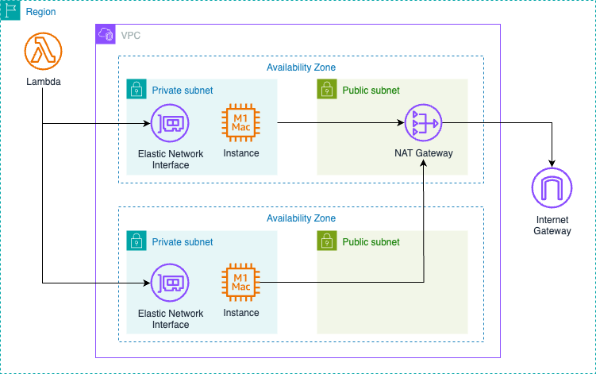

# 🧠 Lambda dentro de una VPC

## 📝 Descripción del problema

El equipo de ingeniería necesita migrar una aplicación a una arquitectura sin servidor, usando AWS Lambda como componente principal. Uno de los desafíos es asegurar que Lambda pueda acceder tanto a recursos privados (como RDS) como públicos (como DynamoDB o Internet).

## ✅ Solución

- Por defecto, las funciones Lambda operan en una VPC administrada por AWS, lo que permite acceso a Internet y a servicios públicos de AWS sin configuración adicional.
- Si se requiere acceder a recursos **en una subred privada**, como RDS, entonces se debe asociar Lambda a una **VPC personalizada**.
- En ese caso, se debe crear una **NAT Gateway** en una subred pública y configurar rutas para que Lambda pueda acceder a Internet desde una subred privada.

## 🖼️ Diagrama de arquitectura

> Puedes editar este diagrama con [draw.io](https://app.diagrams.net/) desde el archivo: [01-lambda-in-a-vpc.drawio](./01-lambda-in-a-vpc.drawio)

## 🧠 Consideraciones

- Asociar Lambda a una VPC puede aumentar el tiempo de arranque (cold start).
- Asegúrate de configurar las rutas correctamente en las tablas de ruteo.
- Usa Security Groups e IAM Roles para controlar accesos.

## 📚 Referencias

- [Lambda networking](https://docs.aws.amazon.com/lambda/latest/dg/configuration-vpc.html)
- [VPC con subredes públicas y privadas](https://docs.aws.amazon.com/vpc/latest/userguide/VPC_Scenario2.html)
