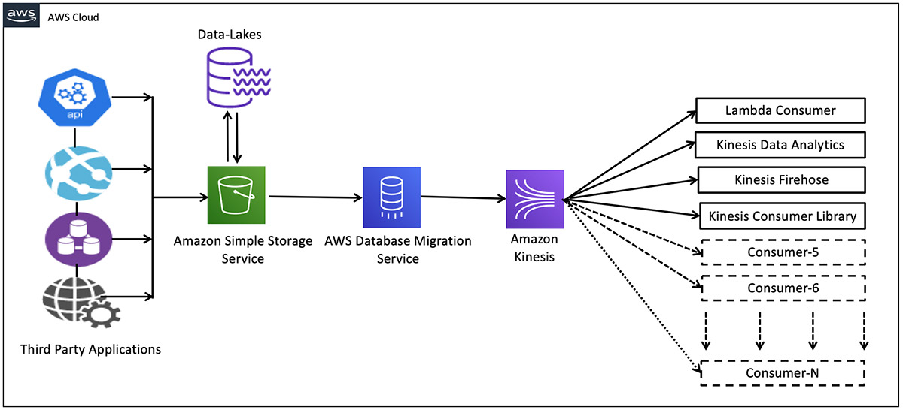

# ⚡ Transmisión de archivos de S3 a Kinesis con AWS DMS

## 📝 Descripción del problema

Una empresa de análisis de Big Data almacena archivos de datos y logs en buckets de Amazon S3. Ahora necesita transmitir tanto los archivos existentes como las actualizaciones futuras hacia **Amazon Kinesis Data Streams** para realizar análisis en tiempo real, y debe implementarse de la forma más rápida posible.

## ✅ Solución

La forma más eficiente y rápida de implementar esta funcionalidad es usando **AWS Database Migration Service (AWS DMS)**.

### 🔧 Beneficios de usar DMS:

- **No requiere escribir código** personalizado.
- Permite **configuración rápida** sin complejas integraciones.
- Soporta **Amazon S3 como origen** y **Kinesis Data Streams como destino**.
- Maneja **archivos completos y cambios incrementales (CDC)**.
- Se pueden escalar las instancias de replicación según la carga.

Una vez que los datos llegan a Kinesis, pueden ser consumidos simultáneamente por varios servicios como:

- AWS Lambda
- Amazon Kinesis Data Firehose
- Kinesis Data Analytics
- Aplicaciones basadas en Kinesis Client Library (KCL)

---

## 🖼️ Diagrama de arquitectura

> 🎯 - [Imagen tomada de aquí](https://aws.amazon.com/blogs/big-data/streaming-data-from-amazon-s3-to-amazon-kinesis-data-streams-using-aws-dms/)

---

## 🧠 Consideraciones

- AWS DMS puede ejecutarse de forma continua o por lotes según la configuración.
- El servicio admite reglas de transformación y filtrado.
- Cada componente de esta arquitectura puede escalar de forma independiente.
- Ideal para implementaciones rápidas sin desarrollar pipelines desde cero.

---

## 📚 Recursos útiles

- [AWS DMS con Amazon S3](https://aws.amazon.com/blogs/big-data/streaming-data-from-amazon-s3-to-amazon-kinesis-data-streams-using-aws-dms/)

