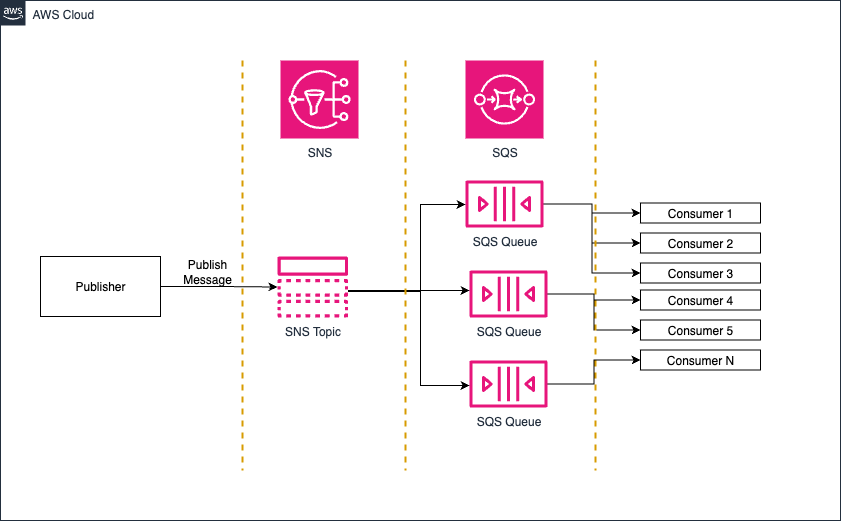

# ⚡ Desacoplamiento de mensajes a escala con SNS y SQS (Fan-Out)

## 📝 Descripción del problema

Una empresa tiene una aplicación que ingiere mensajes a gran velocidad. Decenas de microservicios y aplicaciones dependientes deben procesar estos mensajes, cuyo volumen puede incrementarse súbitamente a **más de 100,000 por segundo**. La empresa necesita desacoplar esta solución y garantizar una **arquitectura escalable y flexible**.

## ✅ Solución

Publicar los mensajes en un tema de **Amazon Simple Notification Service (Amazon SNS)** con múltiples suscripciones de **Amazon Simple Queue Service (Amazon SQS)**. Configurar las aplicaciones consumidoras para que procesen los mensajes de las colas:

- Este es el patrón clásico de **distribución ramificada (fan-out)**.

- **Amazon SNS** es un servicio de mensajería de publicación/suscripción (pub/sub). Un productor envía un único mensaje a un "tema" (topic) de SNS.

- **Amazon SQS** es un servicio de colas de mensajes.

- Al suscribir múltiples colas SQS a un tema SNS, cada mensaje publicado en el tema se entrega a **todas las colas suscritas**. Cada aplicación consumidora puede entonces procesar los mensajes de su propia cola SQS de forma independiente, a su propio ritmo.

- **Escalabilidad y Durabilidad:** Esta arquitectura es extremadamente escalable y resiliente. SNS puede manejar un volumen masivo de publicaciones. SQS actúa como un búfer para cada consumidor, asegurando que los mensajes no se pierdan si un consumidor está temporalmente no disponible o sobrecargado. La mención de 100,000 mensajes/segundo sugiere que se necesitaría un servicio de alta capacidad como SNS.
---

## 🖼️ Diagrama de arquitectura

> 🎯 Diagrama editable: [03-sns-sqs-fanout.drawio](./03-sns-sqs-fanout.drawio)

---

## 🧠 Ventajas clave

- **Desacoplamiento total** entre productores y consumidores.
- **Alta escalabilidad**: SNS admite tasas de publicación extremadamente altas.
- **Tolerancia a fallos**: si un consumidor falla, los mensajes permanecen en SQS.
- **Procesamiento paralelo**: cada consumidor procesa su cola de forma independiente.
- **Elasticidad**: los consumidores pueden escalar horizontalmente según demanda.
- **Aislamiento**: un consumidor lento no afecta a los demás.

---

## 🔧 Consideraciones

- Puedes usar colas **FIFO** si el orden es importante.
- Configura el tiempo de retención en SQS según las necesidades de procesamiento.
- Usa **DLQs (Dead-Letter Queues)** para manejar errores de procesamiento.
- Monitorea con **Amazon CloudWatch** las métricas de SNS y SQS.
- Usa **AWS Lambda** o contenedores como consumidores para escalar automáticamente.

---

## 📚 Recursos útiles

- [Fan-out using SNS and SQS](https://docs.aws.amazon.com/sns/latest/dg/sns-sqs-as-subscriber.html)
- [Best Practices for SQS](https://docs.aws.amazon.com/AWSSimpleQueueService/latest/SQSDeveloperGuide/sqs-best-practices.html)
- [Amazon SNS Overview](https://docs.aws.amazon.com/sns/latest/dg/welcome.html)
