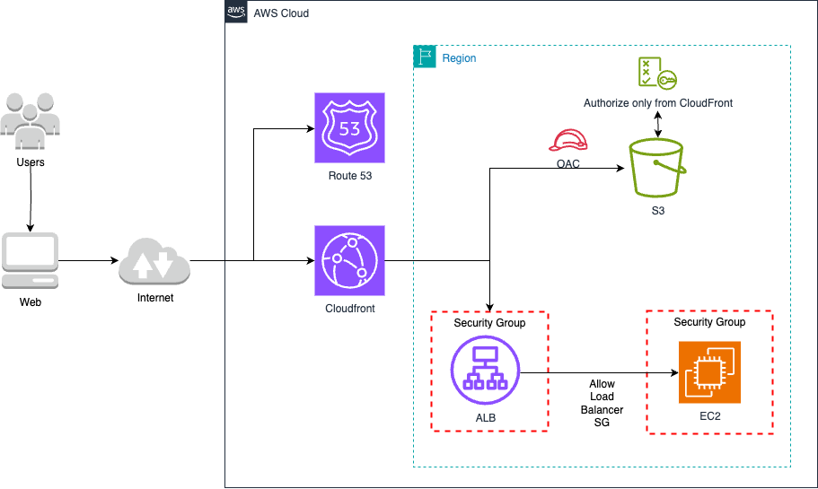

# 🌍 Optimización de rendimiento web con CloudFront, S3, ALB y Route 53

## 📝 Descripción del problema

Una empresa global aloja su aplicación web en **instancias EC2** detrás de un **Application Load Balancer (ALB)**. Los activos estáticos (imágenes, JS, CSS) están almacenados en **Amazon S3**, mientras que el contenido dinámico es servido desde EC2.

El equipo desea **mejorar el rendimiento y reducir la latencia global**, tanto para datos estáticos como dinámicos, utilizando su propio nombre de dominio registrado en **Amazon Route 53**.

## ✅ Solución

Para cumplir con estos objetivos, se recomienda implementar la siguiente arquitectura:

- Crear una **distribución de Amazon CloudFront** con dos orígenes:
  - 🔹 **Bucket de S3** para los archivos estáticos.
  - 🔸 **Application Load Balancer** para el contenido dinámico.
- Configurar **comportamientos de origen** en CloudFront para enrutar peticiones `/static/*` hacia S3, y las demás hacia el ALB.
- Usar **Amazon Route 53** para enrutar el tráfico del dominio personalizado (por ejemplo, `www.ejemplo.com`) hacia CloudFront.

---

## 🖼️ Diagrama de arquitectura

> 🎯 Diagrama editable: [05-cloudfront-s3-alb.drawio](./05-cloudfront-s3-alb.drawio)

---

## 💡 Beneficios clave

- 🚀 **Reducción de latencia**: CloudFront entrega el contenido desde ubicaciones edge distribuidas globalmente.
- 📦 **Separación de contenido estático/dinámico**: optimiza el enrutamiento y cacheo.
- 🌐 **Escalabilidad**: CloudFront escala automáticamente frente a grandes volúmenes de tráfico.
- 🔐 **Seguridad mejorada**: con HTTPS, OAI (Origin Access Identity) para proteger el bucket S3, y WAF opcional.
- 🧭 **Gestión unificada de DNS** con Amazon Route 53 y su integración nativa con CloudFront.

---

## 🔧 Consideraciones

- Habilita **caché personalizado** para maximizar el cacheo de respuestas dinámicas donde sea posible.
- Configura **TTL apropiados** en CloudFront para cada origen.
- Usa **Lambda@Edge** o **CloudFront Functions** si necesitas manipular encabezados o URIs antes de redirigir.
- Protege el bucket S3 con OAC (Origin Access Control) u OAI (si es más antiguo).
- Asegúrate de usar certificados SSL válidos en CloudFront (puedes usar ACM en us-east-1).

---

## 📚 Recursos útiles

- [Integrar CloudFront con Route 53](https://docs.aws.amazon.com/Route53/latest/DeveloperGuide/routing-to-cloudfront-distribution.html)
