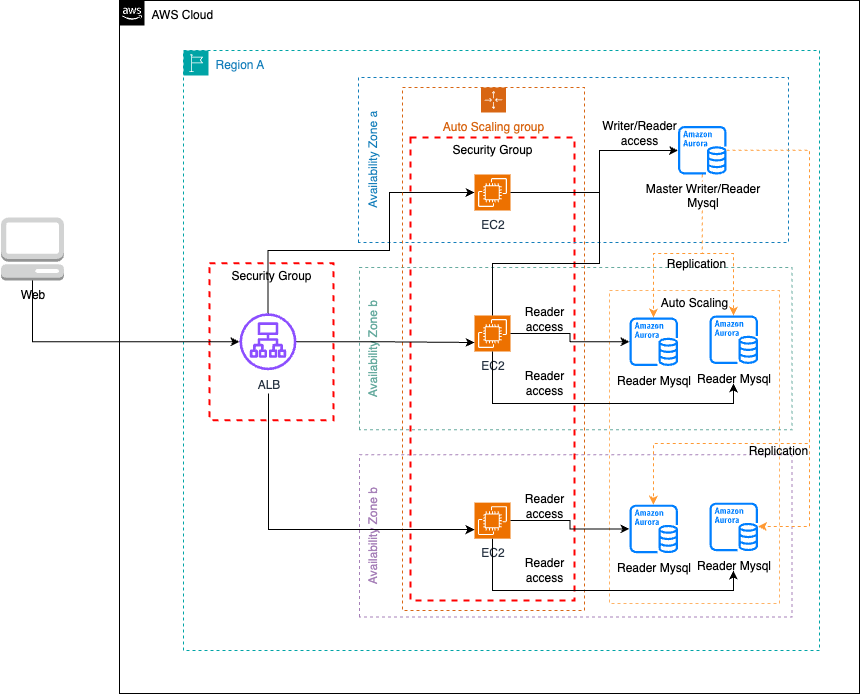

# 🧩 Escalado automático de base de datos para lecturas con Aurora Replicas y Auto Scaling

## 📝 Descripción del problema

Una empresa opera una aplicación de comercio electrónico en instancias de **Amazon EC2** detrás de un **Application Load Balancer (ALB)**. La capa de cómputo ya escala automáticamente en múltiples Zonas de Disponibilidad mediante **Auto Scaling** con métricas de CPU.

La base de datos actual —una instancia EC2 con MySQL 8.0— no escala adecuadamente y **su rendimiento se degrada** con cargas elevadas. Dado que la aplicación realiza más **lecturas que escrituras**, se necesita una solución que:

- Mantenga **alta disponibilidad**.
- Escale automáticamente para manejar **cargas de lectura variables e impredecibles**.

## ✅ Solución

Migrar a **Amazon Aurora (MySQL compatible)** con la siguiente configuración:

1. **Implementación Multi-AZ** para alta disponibilidad y durabilidad.
2. Configurar múltiples **Aurora Replicas** en zonas de disponibilidad distintas.
3. Habilitar **Aurora Auto Scaling** para que aumente o disminuya automáticamente el número de réplicas en función de la carga de lectura.

---

## 🖼️ Diagrama de arquitectura

> 🎯 Diagrama editable: [06-aurora-replicas-autoscaling.drawio](./06-aurora-replicas-autoscaling.drawio)

---

## 💡 Beneficios clave

- 🔁 **Escalado automático de lectura** según demanda con Aurora Auto Scaling.
- 🔐 **Alta disponibilidad Multi-AZ** y failover automático.
- 🚀 **Reducción de latencia de lectura** al distribuirla entre réplicas.
- 🧠 Administración simplificada con Aurora como servicio completamente gestionado.
- ⚙️ Compatible con **EC2 Auto Scaling** en la capa de aplicación, lo que permite una arquitectura **completamente escalable**.

---

## 🔧 Consideraciones técnicas

- La carga de escritura se dirige al **writer node** (instancia principal de Aurora).
- Las **lecturas** pueden balancearse entre las réplicas Aurora a través de un **Aurora Reader Endpoint**.
- El escalado se basa en métricas como **CPU**, **conexiones** o **lag de replicación**.
- Es posible establecer **límites mínimos y máximos** de réplicas con Auto Scaling.

---

## 📚 Recursos útiles

- [Aurora Replicas](https://aws-solutions-library-samples.github.io/ai-ml/disaster-recovery-using-amazon-aurora.html)
